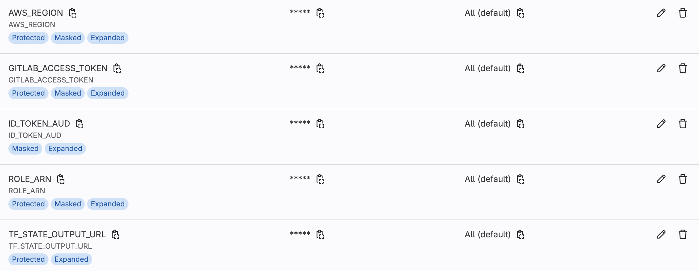

# GitLab Pipelines

GitLab is an excellent platform to deploy your project with just one click. This repository contains examples of how to set up one-click deployments of your apps using GitLab pipelines and AWS.

    

## Core Project Templates

Explore the core templates for the deployment process:

- [Infrastructure with Terraform](https://github.com/xajik/dazhbog-tf)
- [Backend Service](https://github.com/xajik/zeus-ai-api-gateway)
- [Database Migration](https://github.com/xajik/veles-db-migration)

## Templates 

- [AWS Assume Role](aws) - A template to fetch credentials from AWS. See the [GitLab documentation](https://docs.gitlab.com/ee/ci/cloud_services/aws/) for setup details.
- [Terraform Infrastructure](terraform) - Pipelines to apply Terraform infrastructure and save the output as artifacts for use in other repositories.
- [Backend Service](backend) - Service deployment to ECS.
- [Web App](web-app) - Upload a web app to S3.

<i>All projects are interconnected and depend on the Terraform output file, which is uploaded as an artifact. You need to set the path to this file in the `$TF_STATE_OUTPUT_URL` environment variable. It is generated by [terraform](terraform) pipelines.</i>

### AWS Credentials 

For the AWS job `assume_role_dotenv_template`, you need to provide the following environment variables in CI/CD:

- `ID_TOKEN_AUD`
- `ROLE_ARN`
- `AWS_REGION`

### Download Artifact 

A token is required in the environment to download the artifact with the Terraform output:

- `GITLAB_ACCESS_TOKEN`

### Group Environment Variables

If you have a group in GitLab, you can configure the above variables at the group level since they are used across all deployments:

## Note

- All components can be placed in a single repository, although I prefer separating them.
- Replace `my-group` with your GitLab group name.
- If you use single repo, `include:` will look different